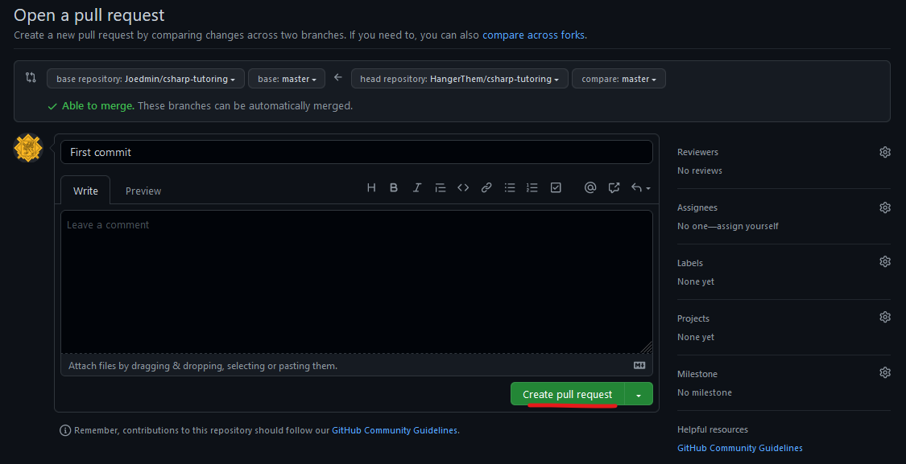
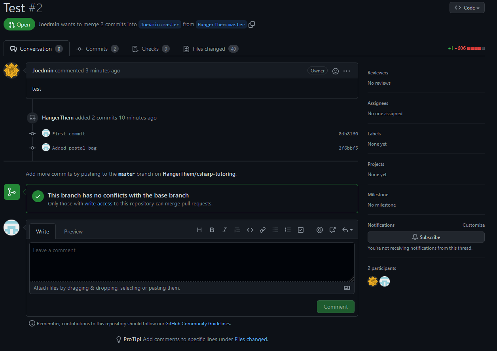
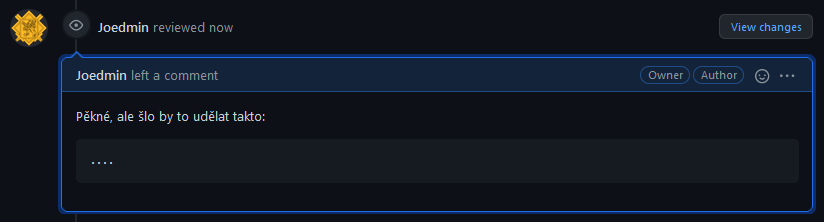

# Doučování CSharp

- [Doučování CSharp](#doučování-csharp)
	- [Jak udělat Pull Request (PR) pro odevzdání úkolů](#jak-udělat-pull-request-pr-pro-odevzdání-úkolů)

## Jak udělat Pull Request (PR) pro odevzdání úkolů

Základem je si tzv forknout repozitář, tedy si vytvořit kopii repozitáře na svém profilu. Forky jsou dobré k tomu, aby jste mohli upravovat cizí repozitář, ke kterému nemáte přístup. Po kliknutí na fork se na vašem profilu vytvoří kopie daného repozitáře.

Po vykonání změn v repozitáři je možné, že budete chtít vytvořit PR do originálního repozitáře, tj. aplikovat své změny do cizího repozitáře.

Abyste vytvořili PR, je třeba kliknout na `Contribute` a následně na `Open pull request`.

Nyní uvidíte shrnutí vaších změn. Klikneme na na `Create pull request`.

Poslednm krokem je napsání o provedených změnách. Napište stručný nadpis PR a případně i nějaký kratší pospis a klikněte na `Create pull request`

Po tomto uvidíte něco takového. Autor originárního repozitáře bude shopen tento PR zkontrolovat, napsat nějaké připomínky a nakonec PR uzavřít - příjmout či zamítnout.

